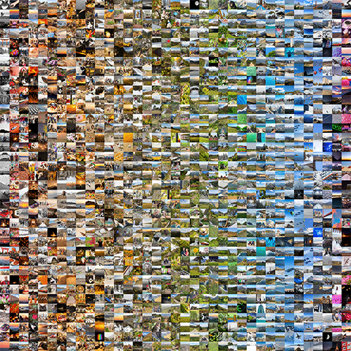

# colorSortedImageGrid
Given a folder of images, sorts the images by color, then outputs the color-sorted image into one NxM image grid. Here's a GIF of some example output images:

I generated the three frames from this example using the same set of [my photographs](https://zachfox.photography/). Here were the three commands I ran to achieve the three frames in the above GIF:
1. `node .\index.js --pxPerImage 128 --visualizationMode normal`
2. `node .\index.js --pxPerImage 128 --visualizationMode 4x4`
3. `node .\index.js --pxPerImage 128 --visualizationMode dominant`

# How do I use this?
1. Clone this repository to your local disk, or download the latest version of the `main` branch code [here](https://github.com/zfox23/colorSortedImageGrid/archive/main.zip).
2. Ensure NodeJS v12.18.x is installed: [https://nodejs.org/en/](https://nodejs.org/en/)
3. Place the images that you'd like to be a part of your output image into `<the downloaded repository directory>\images`.
    - These images must be in `.jpg` or `.png` format.
4. Open a PowerShell/Command Prompt/Terminal window, then `cd` into the directory containing this repository.
5. Run `npm i` to install this project's dependencies.

## Now you're ready to run the script!
- Run `node index.js` without any arguments to let the script execute its default behavior.
    - The script's default behavior is to sort your images by color in column-major order, creating a square output image.
- Run `node index.js -h` to see all possible command line arguments. There are a bunch!

## A few notes and things to try...
- I've left some test images inside `./images/test/` of various colors and sizes which you can use to test out the script.
    - Try running `node index.js -i "./images/test"`
- Experiment with the way the images are sorted by using the `--sortParameter`...parameter...
- You can adjust the default column-major sorting order to row-major by passing `--sortOrder row-major` to the script.

Enjoy! 💖
